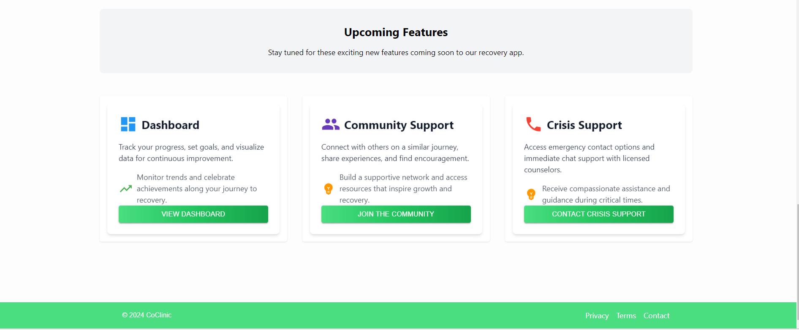
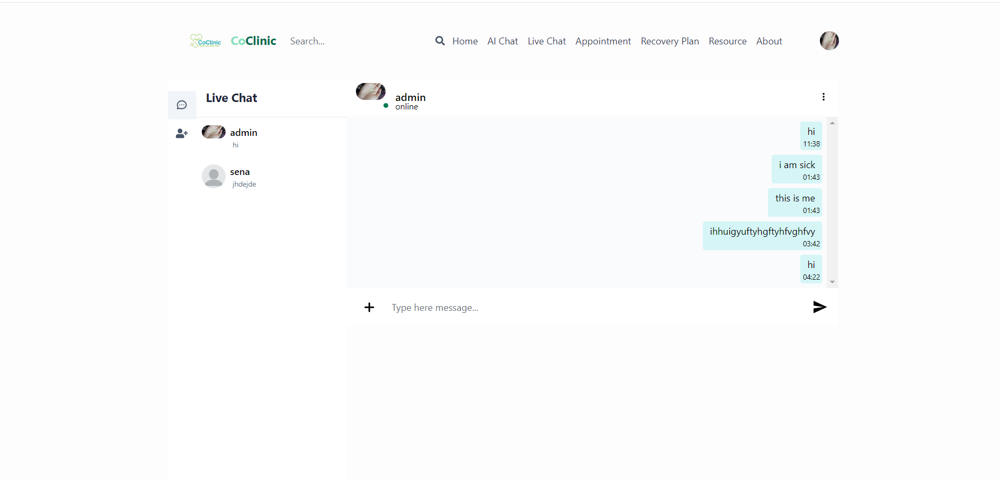

## Table of Contents

- [Table of Contents](#table-of-contents)
- [CoClinic](#coclinic)
- [Home](#home)
- [Support](#support)
- [Upcoming](#upcoming)
- [Live Chat](#live-chat)
- [AI Chat](#ai-chat)
- [AI Chat](#ai-chat-1)
- [Features that must implemented](#features-that-must-implemented)
- [Features that  implemented if time permit](#features-that--implemented-if-time-permit)
- [Tech Stack](#tech-stack)
- [How to run](#how-to-run)
- [Clone the Repository](#clone-the-repository)
- [Prototype Link](#prototype-link)
- [Prototype link](#prototype-link-1)

  


## CoClinic
  **CoClinic** is an innovative telehealth platform designed to provide seamless healthcare services through live consultations and interactive AI support.
  The platform focuses on enhancing the patient experience by offering multiple avenues for interaction, including direct communication with doctors and AI-based chatbots for preliminary consultations.

## Home


## Support


## Upcoming


## Live Chat


## AI Chat


## AI Chat


## Features that must implemented 

- **Live Chatting with Doctors**: 
  - Patients can initiate live chat sessions with available doctors for immediate consultation.
  - Doctors can share treatment plans, respond to patient inquiries, and provide follow-up care.
  - Integrated file sharing for health reports, test results, and prescriptions.

- **Live Chatting with AI Chatbot**:
  - Patients can interact with an AI chatbot for initial triage and symptom analysis.
  - The chatbot can answer common health-related questions and recommend whether a patient should consult a doctor.


- **Online Consultations (chat)**:
  - Secure live chat for comprehensive consultations.

- **Admin Dashboard**:
  - Admins can monitor user activity, manage user role


## Features that  implemented if time permit 
- **Billing and Payment Integration**:
  - Patients can view their bills, make payments, and download invoices.
  - Integrated payment gateway for seamless transactions.
- **Electronic Health Records (EHR)**:
  - Secure patient profile management with health history, past appointments, and medication records.
  - Doctors can update records and upload reports for each patient after consultations.
- **Online Consultations (Video & Audio)**:
  - Secure video and audio  calls chat for comprehensive consultations.
  - Integrated with a third-party video service  (Zoom API).
- **Digital Prescriptions**:
  - Doctors can issue digital prescriptions that patients can download or view within the platform.
- **Appointment Scheduling & Management**:
  - Patients can schedule in-person or virtual appointments based on doctor availability.
  - Doctors can manage their schedules, view upcoming appointments, and send reminders.


## Tech Stack
- **Frontend**: React with Tailwind CSS
- **Backend**: Node.js with Express
- **Database**: MongoDB
- **Cloud Services**: Google Cloud Platform (GCP)
- **Authentication**: JWT-based authentication
- **Deployment**: GCP services like Cloud Functions, Cloud Scheduler, and GCS


## How to run

Before you begin, ensure you have the following installed on your machine:

- [Node.js](https://nodejs.org/) (v14 or later)
- [npm](https://www.npmjs.com/) or [yarn](https://yarnpkg.com/)
- [MongoDB](https://www.mongodb.com/) (or any other database you intend to use)
- [Git](https://git-scm.com/)


## Clone the Repository

1. Open your terminal.
2. Clone the repository:

   ```bash
   git clone https://github.com/kika1s1/coclinic.git

    cd coclinic

    npm install

    cd ../client

    npm install

    cd ..

    npm run dev
3.  add `.env` in both coclinic root and on client root
   


## Prototype Link
- **Postman Docummentation**: [Postman Documentation](https://documenter.getpostman.com/view/36018169/2sAXxJjbLa)


## Prototype link
- **Figma Design**: [Figma Design](https://www.figma.com/design/rfQw6dqtZmoA0PmTSwmUjH/CoClinic?node-id=0-1&t=HeFqUf8QsQ6nlb0g-1)